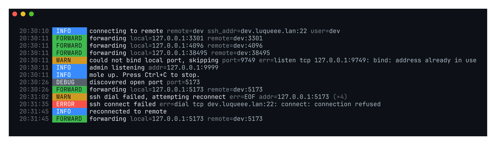

<div align="center">

# 🦫 mole

**Hit `localhost:3000` as if it were always running — even when the real service lives on another machine.**

[](https://go.dev)
[](#-platforms)
[](#-install)
[](#-license)

</div>

---

`mole` opens **one** SSH connection to a remote host and forwards local TCP
ports through it to the same ports on the remote. Turn on auto-discover and it
figures out **what's actually listening** on the remote and forwards it for
you — no port list to maintain. Run it in the background and watch it pick up
new dev servers as you start them.

```
┌────────────┐      one SSH connection       ┌──────────────────┐
│  browser   │ ──►  localhost:3000  ──►──────►│  workstation:3000│
│  curl      │ ──►  localhost:5173  ──►──────►│  workstation:5173│
│  whatever  │ ──►  localhost:8080  ──►──────►│  workstation:8080│
└────────────┘             ▲                  └──────────────────┘
                           │  mole runs here, on your laptop
```

## ✨ Features

| | |
|---|---|
| 🔌 **One connection** | A single SSH client multiplexes every forwarded port. |
| 🔭 **Smart auto-discover** | Enumerates the remote's real TCP listeners (`ss`/`netstat`) and forwards them — any port, not a fixed list. Re-scans every 15s, so servers you start *after* launch get picked up. |
| 🧭 **SSH config aliases** | A `remote` like `dev` is resolved through `~/.ssh/config` (`ssh -G`): HostName, User, Port, IdentityFile, Include, Match — all honoured. |
| 🛡️ **Exclude list** | System/reserved ports (22, 25, 53, 111, 631) are skipped by default; fully configurable. |
| ♻️ **Auto-reconnect** | Transparent reconnect on tunnel drop, with periodic health checks. |
| 🔑 **Native auth** | ssh-agent first (Unix socket / Windows named pipe), then `~/.ssh/id_*` keys. |
| 🌙 **Background daemon** | `mole up -d` detaches; `mole down` stops it; `mole status` and `mole logs` introspect it. |
| 🎨 **Beautiful logs** | `mole logs` renders the daemon log with colour level badges, a green `FORWARD` badge, and `(×N)` collapsing of repeats. |
| 📦 **Single binary** | No runtime, no `node_modules`, no background service to manage. |

## 🎨 Beautiful logs

`mole logs` renders the daemon's structured log with coloured level badges, a
distinct green **FORWARD** badge for forwarded ports, dimmed timestamps, and
`(×N)` collapsing of repeated lines:

<div align="center">
  
</div>

## 🚀 Quickstart

```bash
# 1. install
curl -fsSL https://raw.githubusercontent.com/Luqueee/mole/main/scripts/install.sh | sh

# 2. configure + start (interactive; accepts an ssh config alias as the remote)
mole init

# 3. later…
mole status      # what's forwarded right now
mole logs -f     # pretty, colourised, live
mole down        # stop the background daemon
```

`mole init` writes the config, then offers to start mole **in the background**
for you. From there it keeps the tunnel up and forwards new servers as they
appear.

## 🧰 Commands

| Command | What it does |
|---------|--------------|
| `mole up` | Start the forwarder in the foreground (add `-d` to background it). |
| `mole down` | Stop a backgrounded mole (started with `up -d`). |
| `mole status` | Query the local admin API for live stats + forwarded ports. |
| `mole logs` | Show the daemon log, colourised; `-f` to follow. |
| `mole init` | Generate a `mole.yaml` interactively (or scripted). |
| `mole version` · `mole help` | The obvious. |

## 📦 Install

Five ways — pick whichever fits. All produce the same single static binary.

### Option 1 — one-liner (no clone, no setup)

The installer detects the platform, builds the binary, and copies it onto your `PATH`.

**Linux / macOS / FreeBSD**

```bash
curl -fsSL https://raw.githubusercontent.com/Luqueee/mole/main/scripts/install.sh | sh
```

**Windows (PowerShell 5+)**

```powershell
iwr -useb https://raw.githubusercontent.com/Luqueee/mole/main/scripts/install.ps1 | iex
```

Default install locations:

| User            | Install location                |
|-----------------|---------------------------------|
| root (Unix)     | `/usr/local/bin/mole`           |
| non-root (Unix) | `~/.local/bin/mole`             |
| Windows         | `%LOCALAPPDATA%\Programs\mole\` |

If the destination isn't on your `PATH`, the script prints the exact line to add to your shell profile.

Useful flags:

```bash
./scripts/install.sh --init          # also launch the configurator
./scripts/install.sh --prefix /opt   # custom prefix
MOLE_VERSION=v0.1.0 ./scripts/install.sh   # pin a ref

.\scripts\install.ps1 -InstallDir $env:LOCALAPPDATA\Programs\mole   # Windows custom dir
.\scripts\install.ps1 -Init                                          # Windows + init
```

### Option 2 — `go install` (no clone, needs Go 1.22+)

```bash
go install github.com/Luqueee/mole/cmd/mole@latest
# ensure the dir is on PATH:
export PATH="$(go env GOPATH)/bin:$PATH"
```

### Option 3 — install script from a clone

```bash
git clone https://github.com/Luqueee/mole && cd mole
./scripts/install.sh                 # Unix   (./scripts/install.ps1 on Windows)
```

Override the destination with `--prefix` or `INSTALL_DIR`:

```bash
./scripts/install.sh --prefix /opt            # → /opt/bin/mole
INSTALL_DIR=~/bin/mole ./scripts/install.sh   # → ~/bin/mole
```

### Option 4 — `make install` from a clone

```bash
git clone https://github.com/Luqueee/mole && cd mole
make install                         # → $(go env GOPATH)/bin/mole
make install PREFIX=/usr/local       # → /usr/local/bin/mole
make install INSTALL_DIR=~/bin/mole  # → ~/bin/mole
```

### Option 5 — fully automatic (scripted, zero prompts)

For CI, dotfiles, Dockerfiles, and `curl | sh` lovers: install the binary **and**
generate a working config in one non-interactive pass. With `-no-prompt`,
`mole init` reads its answers from `MOLE_*` env vars, so there's nothing to type.
The installer auto-detects the non-TTY stdin and forwards `-no-prompt` for you.

```bash
curl -fsSL https://raw.githubusercontent.com/Luqueee/mole/main/scripts/install.sh \
  | MOLE_REMOTE=dev@workstation \
    MOLE_AUTO_DISCOVER=true \
    sh -s -- --init
```

Add `MOLE_GLOBAL=true` to write `~/.config/mole/config.yaml` (per-user) instead
of `./mole.yaml` (per-project). Pin a ref with `MOLE_VERSION=v0.1.0`. On Windows,
set `$env:MOLE_*` and run `iwr … | iex -Init`.

### Build without installing

```bash
make build      # → ./dist/mole
# or: go build -trimpath -o ./mole ./cmd/mole
```

### Uninstall

```bash
./scripts/uninstall.sh                 # Unix   (./scripts/uninstall.ps1 on Windows)
curl -fsSL https://raw.githubusercontent.com/Luqueee/mole/main/scripts/uninstall.sh | sh
./scripts/uninstall.sh --purge         # also drop ~/.config/mole/
make uninstall
```

For `go install`, just remove `$(go env GOPATH)/bin/mole`.

## 🛠️ Usage

### Foreground vs background

```bash
mole up                 # foreground (Ctrl+C to stop) — great for debugging
mole up -d              # background daemon — returns your shell
mole down               # stop the daemon
```

### Pick the remote

The `remote` can be an explicit target **or an SSH config Host alias**:

```bash
mole up --remote dev@workstation     # explicit user@host[:port]
mole up --remote dev                 # alias from ~/.ssh/config (resolved via ssh -G)
```

### Pick the ports

```bash
mole up --remote dev --auto-discover           # forward whatever's listening on the remote
mole up --remote dev --ports 3000,5173,8080    # forward an explicit set
```

With `--auto-discover`, mole enumerates the remote's TCP listeners and forwards
the loopback-reachable ones, skipping the configured `exclude_ports`. It re-scans
every 15 seconds, so a dev server you start later is forwarded automatically —
no restart needed.

### Config file

Drop a `mole.yaml` in your project (or generate it with `mole init`):

```yaml
remote: dev                    # user@host[:port] or an ssh config alias
auto_discover: true
exclude_ports: [22, 25, 53, 111, 631]   # never auto-forwarded; [] excludes nothing
admin_addr: 127.0.0.1:9999
log_level: info
```

`mole up` looks for `./mole.yaml` first, then the user-global
`~/.config/mole/config.yaml`, so a config written by `mole init -global`
is picked up from anywhere.

### Inspect a running daemon

```bash
mole status        # JSON: uptime, connections, and the live forwarded-port set
mole logs          # pretty, colourised log (last 200 lines)
mole logs -f       # follow, like tail -f
mole logs -n 50 --no-dedup
```

`mole logs` parses the daemon's structured log and renders it with coloured
level badges (a distinct green **FORWARD** badge for forwarded ports), a dimmed
timestamp, and collapses consecutive identical lines into one with a `(×N)`
counter. Colour auto-disables when piped or when `NO_COLOR` is set (`--color`
forces it back on).

### Generate the config with `mole init`

`mole init` ships **inside the binary** — no separate script — so the prompts
are identical on every OS and always in sync with the loader.

| Mode | When | How |
|------|------|-----|
| **Interactive** | first-time setup | `mole init` |
| **Semi-interactive** | you know the remote | `mole init -remote dev` |
| **Fully scripted** | CI, Docker, no TTY | `mole init -no-prompt -remote … [-auto-discover]` |

```text
$ mole init
configuring mole — press Enter to accept the default in [brackets]
SSH remote (user@host[:port] or ssh config alias): dev
How should mole pick ports?
  1) auto-discover common dev ports (recommended)
  2) explicit list (comma-separated)
  3) skip — I'll configure ports later
  choose [1]: 1
Where to save the config?
  1) ./mole.yaml               (current directory, project-local)
  2) ~/.config/mole/config.yaml  (user-global)
  3) don't save — print to stdout instead
  choose [1]: 2
wrote ~/.config/mole/config.yaml
Start mole now? [Y/n]: y
starting mole in the background
```

Useful `init` flags: `-global`, `-print`, `-no-prompt`, `-yes`, `-test`,
`-force`, `-up`. Environment fallbacks (read when the matching flag is empty):
`MOLE_REMOTE`, `MOLE_PORTS`, `MOLE_AUTO_DISCOVER`, `MOLE_CONFIG_PATH`,
`MOLE_GLOBAL`.

## 📖 CLI reference

```text
mole up [flags]
  -config         path to YAML config (default: ./mole.yaml, then user-global)
  -remote         SSH target (user@host[:port]) or an ssh config alias
  -ports          comma-separated ports to forward (e.g. 3000,5173)
  -auto-discover  forward whatever is listening on the remote
  -admin          admin HTTP address (empty to disable)
  -log-level      debug|info|warn|error
  -d, -detach     run in the background; stop with 'mole down'

mole down
mole status [-admin 127.0.0.1:9999]
mole logs   [-f] [-n N] [-raw] [-color] [-no-color] [-no-dedup]
mole init   [flags]
mole version · mole help
```

## ⚙️ Config reference

| Field            | Type   | Default              | Notes                                              |
|------------------|--------|----------------------|----------------------------------------------------|
| `remote`         | string | —                    | `user@host[:port]` **or** an ssh config alias (required) |
| `ports`          | int[]  | `[]`                 | Explicit ports — always forwarded                  |
| `auto_discover`  | bool   | `false`              | Forward the remote's live listeners                |
| `discover_ports` | int[]  | see below            | Fallback probe list when `ss`/`netstat` are absent |
| `exclude_ports`  | int[]  | `[22,25,53,111,631]` | Never auto-forwarded; `[]` excludes nothing        |
| `admin_addr`     | string | `127.0.0.1:9999`     | Admin HTTP address (empty to disable)              |
| `log_level`      | string | `info`               | `debug`, `info`, `warn`, `error`                   |
| `ssh_port`       | int    | `22`                 | SSH port on the remote                             |

Fallback `discover_ports`:

```
3000 3001 3002 3003 3004 3005
4200 5173 5174 5327
6006 8000 8080 8081 8443 9000 9090
```

## 🔬 How it works

1. Open **one** SSH client connection to the remote (ssh-agent or `~/.ssh/id_*`
   keys; aliases resolved via `ssh -G`).
2. Discover ports: enumerate the remote's TCP listeners (`ss`/`netstat`), or
   fall back to probing `discover_ports`. Skip `exclude_ports`.
3. For each port, bind `127.0.0.1:<port>` locally; on a local connection, dial
   `127.0.0.1:<port>` through the tunnel and bridge bytes both ways.
4. Re-discover every 15s and forward anything new; a watchdog goroutine
   reconnects the SSH session if it dies.

State (pidfile + background log) lives in `~/.local/state/mole/` on Unix
(honouring `XDG_STATE_HOME`) and `%LOCALAPPDATA%\mole\` on Windows.

## 💻 Platforms

Single static Go binary — **Linux**, **macOS**, **Windows** (amd64 & arm64).
SSH auth is native per platform:

- **Linux / macOS / BSD** — ssh-agent over a Unix socket (`SSH_AUTH_SOCK`).
- **Windows** — ssh-agent over the OpenSSH named pipe
  (`\\.\pipe\openssh-ssh-agent`).

## ⚠️ Limitations

- **Host key verification is off** (`InsecureIgnoreHostKey`) — fine for dev, not
  for untrusted networks. *(known_hosts support planned for v0.2.)*
- **Forwarded ports are added, not removed** — when a remote server stops, its
  local listener stays open until mole restarts.
- **TCP only** — no UDP forwarding yet.
- **Pageant** (PuTTY's Windows agent) isn't supported — OpenSSH agent only.

## 🧑‍💻 Development

```bash
make build      # → ./dist/mole
make install    # build + install (PREFIX=/usr/local or INSTALL_DIR=… to override)
make test       # go test ./...
make tidy
make clean
```

## 📄 License

MIT.
