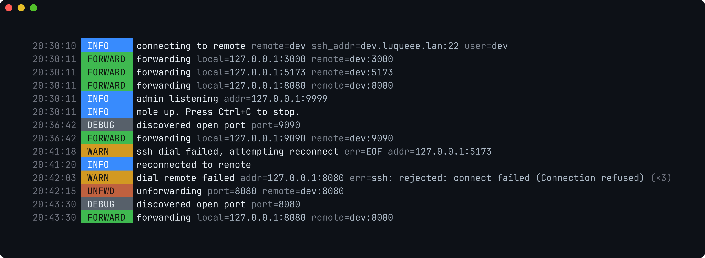

<div align="center">

# 🦫 mole

**Hit `localhost:3000` as if it were always running — even when the real service lives on another machine.**

[](https://go.dev)
[](#-platforms)
[](#-install)
[](#-license)

</div>

---

`mole` opens **one** SSH connection to a remote host and forwards local TCP
ports through it to the same ports on the remote. With auto-discovery, it
checks the remote's TCP listeners or probes a configured port list when
listener enumeration is unavailable. Run it in the background to pick up new
dev servers as they start.

```
┌────────────┐      one SSH connection       ┌──────────────────┐
│  browser   │ ──►  localhost:3000  ──►──────►│  workstation:3000│
│  curl      │ ──►  localhost:5173  ──►──────►│  workstation:5173│
│  whatever  │ ──►  localhost:8080  ──►──────►│  workstation:8080│
└────────────┘             ▲                  └──────────────────┘
                           │  mole runs here, on your laptop
```

## ✨ Features

| | |
|---|---|
| 🔌 **One connection** | A single SSH client multiplexes every forwarded port. |
| 🔭 **Smart auto-discover** | Enumerates the remote's TCP listeners with `ss` or `netstat`; if neither works, probes `discover_ports`. Re-scans every 15s to pick up new servers. |
| 🧭 **SSH config aliases** | A `remote` like `dev` is resolved through `~/.ssh/config` (`ssh -G`): HostName, User, Port, IdentityFile, Include, Match — all honoured. |
| 🛡️ **Exclude list** | System/reserved ports (22, 25, 53, 111, 631) are skipped by default; fully configurable. |
| ♻️ **Auto-reconnect** | Transparent reconnect on tunnel drop, with periodic health checks. |
| 🔑 **Native auth** | ssh-agent first (Unix socket / Windows named pipe), then `~/.ssh/id_*` keys. |
| 🌙 **Background daemon** | `mole up -d` detaches; `mole down` stops it; `mole status` and `mole logs` introspect it. |
| 🎨 **Beautiful logs** | `mole logs` renders the daemon log with colour level badges, a green `FORWARD` badge, and `(×N)` collapsing of repeats. |
| 📦 **Single binary** | No separate runtime or `node_modules`; daemon mode uses the same executable. |

## 🎨 Beautiful logs

`mole logs` renders the daemon's structured log with coloured level badges, a
distinct green **FORWARD** badge when a port starts forwarding and a burnt-orange
**UNFWD** badge when a dead remote port is pruned, dimmed timestamps, and
`(×N)` collapsing of repeated lines:

<div align="center">
  
</div>

## 🚀 Quickstart

Install on **Windows** with PowerShell 5.1 or newer:

```powershell
irm https://raw.githubusercontent.com/Luqueee/mole/main/scripts/install.ps1 | iex
```

On **Linux, macOS, or FreeBSD**, install with Go 1.26.4+ and Git available:

```bash
curl -fsSL https://raw.githubusercontent.com/Luqueee/mole/main/scripts/install.sh | sh
```

Open a new terminal if needed, then start mole with an SSH `Host` alias from
your `~/.ssh/config`. On a fresh install, choose how to select ports:

```text
mole up --remote devlabs --auto-discover -d
mole logs -f
mole down
```

Replace `devlabs` with your own SSH alias. Press Ctrl+C to stop following logs;
the daemon keeps running until `mole down`.

Use `--ports 3000,5173` instead of `--auto-discover` to forward specific ports.
If `./mole.yaml` or your user-global config already sets `auto_discover: true`
or `ports:`, use the shorter command:

```text
mole up --remote devlabs -d
```

The `-d` flag starts mole in the background. Run `mole init` if you want to
create a config interactively.

## 🧰 Commands

| Command | What it does |
|---------|--------------|
| `mole up` | Start the forwarder in the foreground (add `-d` to background it). |
| `mole down` | Stop a backgrounded mole (started with `up -d`). |
| `mole restart` | Stop and re-launch a backgrounded mole using the same config. |
| `mole status` | Query the local admin API for live stats + forwarded ports. |
| `mole logs` | Show the daemon log, colourised; `-f` to follow, `clean` to truncate it. |
| `mole ports` | Manage the auto-discover port list: `add`, `remove`/`rm`, `list`/`ls`. |
| `mole config` | `config edit` opens the active `mole.yaml` in `$VISUAL` / `$EDITOR`. |
| `mole init` | Generate a `mole.yaml` interactively (or scripted). |
| `mole clip` | Share clipboard images over a separate private HTTP connection: `clip serve`, `clip pull`. |
| `mole update` | Update in place using the installer (latest source on Unix, latest release on Windows). |
| `mole version` · `mole help` | The obvious. |

## 📦 Install

### Installers

Outside a local mole clone, the Windows installer downloads the latest release
for amd64 or arm64, checks its SHA-256, and adds the install directory to your
user `PATH`. It needs PowerShell 5.1 or newer, but no Go or Git:

```powershell
irm https://raw.githubusercontent.com/Luqueee/mole/main/scripts/install.ps1 | iex
```

The Unix installer builds from a local mole clone when run inside one;
otherwise it clones the latest `main`. This one-liner needs Go 1.26.4+, Git,
and curl:

```bash
curl -fsSL https://raw.githubusercontent.com/Luqueee/mole/main/scripts/install.sh | sh
```

| Platform | Default binary location |
|----------|-------------------------|
| Windows | `%LOCALAPPDATA%\Programs\mole\mole.exe` |
| Linux, macOS, FreeBSD (user) | `~/.local/bin/mole` |
| Linux, macOS, FreeBSD (root) | `/usr/local/bin/mole` |

Open a new PowerShell session to use the updated user `PATH`. On Unix, the
installer prints a `PATH` hint when needed.

To install from a local clone, run `./scripts/install.sh` on Unix or
`.\scripts\install.ps1` in PowerShell; both build from source with Go. You can
also download a [prebuilt archive](https://github.com/Luqueee/mole/releases/latest)
for any supported platform and check it against the release's `SHA256SUMS`.

Custom destinations and version pins:

```bash
./scripts/install.sh --prefix /opt              # /opt/bin/mole
INSTALL_DIR=~/bin/mole ./scripts/install.sh      # exact binary path
MOLE_VERSION=v0.1.1 ./scripts/install.sh         # Git ref, outside a clone
```

```powershell
.\scripts\install.ps1 -InstallDir 'C:\Tools\mole' # from a clone; requires Go
```

Outside a clone, pin a published Windows release before using the one-liner:

```powershell
$env:MOLE_VERSION = 'v0.1.1'
irm https://raw.githubusercontent.com/Luqueee/mole/main/scripts/install.ps1 | iex
```

The `-InstallDir` PowerShell option accepts a directory. The `INSTALL_DIR`
environment variable accepts the full path to `mole.exe`.

### Other ways to install

With Go 1.26.4+:

```bash
go install github.com/Luqueee/mole/cmd/mole@latest
```

Add your Go `GOPATH/bin` directory to `PATH` if needed. From a clone on Unix,
`make install` builds into `$(go env GOPATH)/bin`; `PREFIX=/usr/local` and
`INSTALL_DIR=/path/to/mole` override that destination.

### Scripted setup

After installing on any platform, create a user-global config without prompts:

```text
mole init -no-prompt -remote dev -auto-discover -global
```

Use `-ports 3000,5173` instead of `-auto-discover` for an explicit list.
`mole init` also reads `MOLE_REMOTE`, `MOLE_PORTS`, `MOLE_AUTO_DISCOVER`,
`MOLE_CONFIG_PATH`, and `MOLE_GLOBAL` when their matching flags are absent.

### Build without installing

```bash
make build      # → ./dist/mole
# or: go build -trimpath -o ./mole ./cmd/mole
```

### Update

Update an installed mole in place — no manual re-clone. It re-runs the official
installer against the running binary's own location:

```bash
mole update                  # latest main on Unix; latest release on Windows
mole update -version v0.1.1  # Unix: Git ref; Windows: release tag
mole update -dry-run         # print what it would run, change nothing
```

Unix updates need Go, Git, and curl or wget. Windows updates need PowerShell.
For a `go install` setup, re-run
`go install github.com/Luqueee/mole/cmd/mole@latest` instead.

### Uninstall

```bash
./scripts/uninstall.sh         # Unix
./scripts/uninstall.sh --purge # also remove the user config
```

On Windows, run `.\scripts\uninstall.ps1` from a clone. For a `go install`
setup, remove the binary from `$(go env GOPATH)/bin`.

## 🛠️ Usage

### Foreground vs background

```bash
mole up                 # foreground (Ctrl+C to stop) — great for debugging
mole up -d              # background daemon — returns your shell
mole down               # stop the daemon
```

### Pick the remote

The `remote` can be an explicit target **or an SSH config Host alias**:

```bash
mole up --remote dev@workstation     # explicit user@host[:port]
mole up --remote dev                 # alias from ~/.ssh/config (resolved via ssh -G)
```

### Pick the ports

```bash
mole up --remote dev --auto-discover           # forward whatever's listening on the remote
mole up --remote dev --ports 3000,5173,8080    # forward an explicit set
```

With `--auto-discover`, mole tries `ss` or `netstat` on the remote and forwards
listeners reachable through remote loopback, excluding `exclude_ports`. If
neither command works, it probes only the ports in `discover_ports`. It repeats
discovery every 15 seconds, so a new server can be forwarded without a restart.

### Config file

Drop a `mole.yaml` in your project (or generate it with `mole init`):

```yaml
remote: dev                    # user@host[:port] or an ssh config alias
auto_discover: true
exclude_ports: [22, 25, 53, 111, 631]   # never auto-forwarded; [] excludes nothing
admin_addr: 127.0.0.1:9999
log_level: info
```

`mole up` looks for `./mole.yaml` first, then the user-global config:
`~/.config/mole/config.yaml` on Unix or `%APPDATA%\mole\config.yaml` on Windows.
`mole init -global` writes to that user-global location.

### Inspect a running daemon

```bash
mole status        # JSON: uptime, connections, and the live forwarded-port set
mole logs          # pretty, colourised log (last 200 lines)
mole logs -f       # follow, like tail -f
mole logs -n 50 --no-dedup
```

`mole status` needs the admin API to be on. It's **off by default** — set
`admin_addr: 127.0.0.1:9999` in the config (`mole init` writes it for you) or
pass `mole up -admin 127.0.0.1:9999`.

`mole logs` parses the daemon's structured log and renders it with coloured
level badges (a distinct green **FORWARD** badge for forwarded ports), a dimmed
timestamp, and collapses consecutive identical lines into one with a `(×N)`
counter. Colour auto-disables when piped or when `NO_COLOR` is set (`--color`
forces it back on).

### Restart, ports, and editing the config

```bash
mole restart                 # stop and re-launch the daemon with the same config

mole ports list              # show the auto-discover port list
mole ports add 4321          # add a discovery candidate
mole ports remove 4321       # or: mole ports rm 4321

mole config edit             # open the active mole.yaml in $VISUAL / $EDITOR
mole config edit -editor nvim

mole logs clean              # truncate the daemon log
mole logs clean -keep 200    # …keeping the last N lines
```

`mole ports` saves changes to the active config. With the admin API enabled,
it also attempts to apply them to a running daemon; otherwise restart mole to
pick up the updated list.

### Clipboard images over a private network

`mole clip` moves clipboard **images** from the machine running `clip serve` to
the one running `clip pull` — useful for pasting a screenshot taken on a remote
desktop. It uses a separate HTTP connection over a private network, such as
Tailscale or WireGuard. Automatic clipboard watching is available on macOS;
`clip pull` works on every supported platform.

```bash
mole clip serve              # on the source Mac; watches its clipboard by default
mole clip pull               # on the target; uses clip_url from the config, or -url
```

The clip endpoint has no authentication and binds to `127.0.0.1:7777` by
default. For a remote pull, bind it to the source machine's private network
address and use the same address in `clip_url`:

```yaml
clip_url: http://100.64.0.10:7777
clip_listen: 100.64.0.10:7777
```

Binding to `0.0.0.0:7777`, `:7777`, or `[::]:7777` is supported for controlled
networks, but `mole clip serve` emits a warning because every interface can
reach the unauthenticated endpoint.


### Generate the config with `mole init`

`mole init` ships **inside the binary** — no separate script — so the prompts
are identical on every OS and always in sync with the loader.

| Mode | When | How |
|------|------|-----|
| **Interactive** | first-time setup | `mole init` |
| **Semi-interactive** | you know the remote | `mole init -remote dev` |
| **Fully scripted** | CI, Docker, no TTY | `mole init -no-prompt -remote … [-auto-discover]` |

```text
$ mole init
configuring mole — press Enter to accept the default in [brackets]
SSH remote (user@host[:port] or ssh config alias): dev
How should mole pick ports?
  1) auto-discover common dev ports (recommended)
  2) explicit list (comma-separated)
  3) skip — I'll configure ports later
  choose [1]: 1
Where to save the config?
  1) ./mole.yaml               (current directory, project-local)
  2) ~/.config/mole/config.yaml  (user-global)
  3) don't save — print to stdout instead
  choose [1]: 2
wrote ~/.config/mole/config.yaml
Start mole now? [Y/n]: y
starting mole in the background
```

Useful `init` flags: `-global`, `-print`, `-no-prompt`, `-yes`, `-test`,
`-force`, `-up`. Environment fallbacks (read when the matching flag is empty):
`MOLE_REMOTE`, `MOLE_PORTS`, `MOLE_AUTO_DISCOVER`, `MOLE_CONFIG_PATH`,
`MOLE_GLOBAL`.

## 📖 CLI reference

```text
mole up [flags]
  -config         path to YAML config (default: ./mole.yaml, then user-global)
  -remote         SSH target (user@host[:port]) or an ssh config alias
  -ports          comma-separated ports to forward (e.g. 3000,5173)
  -auto-discover  forward whatever is listening on the remote
  -admin          admin HTTP address (empty to disable)
  -log-level      debug|info|warn|error
  -insecure       disable SSH host key verification (UNSAFE; dev only)
  -d, -detach     run in the background; stop with 'mole down'

mole down
mole restart [-config PATH]
mole status  [-admin 127.0.0.1:9999]
mole logs    [-f] [-n N] [-raw] [-color] [-no-color] [-no-dedup]
mole logs clean [-keep N]
mole ports  add [-config PATH] <port>
mole ports  remove|rm [-config PATH] <port>
mole ports  list|ls [-config PATH]
mole config edit [-config PATH] [-editor CMD]
mole init   [flags]
mole clip   serve [-listen 127.0.0.1:7777] [-watch] [-config PATH] [-log-level L]
mole clip   pull  [-url URL] [-config PATH] [-log-level L]
mole update [-version REF] [-dry-run] [-no-verify]
mole version · mole help
```

## ⚙️ Config reference

| Field            | Type   | Default              | Notes                                              |
|------------------|--------|----------------------|----------------------------------------------------|
| `remote`         | string | —                    | `user@host[:port]` **or** an ssh config alias (required) |
| `ports`          | int[]  | `[]`                 | Explicit ports — always forwarded                  |
| `auto_discover`  | bool   | `false`              | Forward the remote's live listeners                |
| `discover_ports` | int[]  | see below            | Fallback probe list when `ss`/`netstat` are absent |
| `exclude_ports`  | int[]  | `[22,25,53,111,631]` | Never auto-forwarded; `[]` excludes nothing        |
| `admin_addr`     | string | `""` (disabled)      | Admin HTTP address; `mole init` writes `127.0.0.1:9999`. Required by `mole status` |
| `log_level`      | string | `info`               | `debug`, `info`, `warn`, `error`                   |
| `ssh_port`       | int    | `22`                 | SSH port on the remote                             |
| `insecure`       | bool   | `false`              | Disable SSH host key verification (UNSAFE; dev only) |
| `clip_url`       | string | —                    | Clip server URL used by `mole clip pull`           |
| `clip_listen`    | string | `127.0.0.1:7777`     | Bind address; use a private Tailscale/WireGuard IP for remote access |
| `clip_interval_ms` | int  | —                    | Clipboard poll interval for `clip serve -watch`    |

Fallback `discover_ports`:

```
3000 3001 3002 3003 3004 3005
4200 5173 5174 5327
6006 8000 8080 8081 8443 9000 9090
```

## 🔬 How it works

1. Open **one** SSH client connection to the remote (ssh-agent or `~/.ssh/id_*`
   keys; aliases resolved via `ssh -G`).
2. Discover ports: enumerate the remote's TCP listeners (`ss`/`netstat`), or
   fall back to probing `discover_ports`. Skip `exclude_ports`.
3. For each port, bind `127.0.0.1:<port>` locally; on a local connection, dial
   `127.0.0.1:<port>` through the tunnel and bridge bytes both ways.
4. Re-discover every 15s and forward anything new; a watchdog goroutine
   reconnects the SSH session if it dies.

State (pidfile + background log) lives in `~/.local/state/mole/` on Unix
(honouring `XDG_STATE_HOME`) and `%LOCALAPPDATA%\mole\` on Windows.

## 💻 Platforms

Single static Go binary — **Linux**, **macOS**, **Windows**, **FreeBSD** (amd64 & arm64).
SSH auth is native per platform:

- **Linux / macOS / BSD** — ssh-agent over a Unix socket (`SSH_AUTH_SOCK`).
- **Windows** — ssh-agent over the OpenSSH named pipe
  (`\\.\pipe\openssh-ssh-agent`).

## ⚠️ Limitations

- **Host keys are verified** against `~/.ssh/known_hosts`. Unknown hosts are
  trusted on first use (recorded automatically, like OpenSSH); a later key
  *mismatch* is refused as a possible MITM. Pass `--insecure` (or
  `insecure: true`) to turn verification off for throwaway dev hosts.
- **Dead ports are pruned only under auto-discover** — when `ss`/`netstat` can be
  enumerated, a remote service that stops has its local listener closed (you'll
  see an `UNFWD` line). Explicitly configured `ports:` are pinned and never
  pruned, and when enumeration isn't available mole only adds, never removes.
- **TCP only** — no UDP forwarding yet.
- **Pageant** (PuTTY's Windows agent) isn't supported — OpenSSH agent only.

## 🧑‍💻 Development

```bash
make build      # → ./dist/mole
make install    # build + install (PREFIX=/usr/local or INSTALL_DIR=… to override)
make run        # build, then run `mole up`
make test       # go test ./...
make tidy
make uninstall
make clean
```

## 📄 License

MIT.
